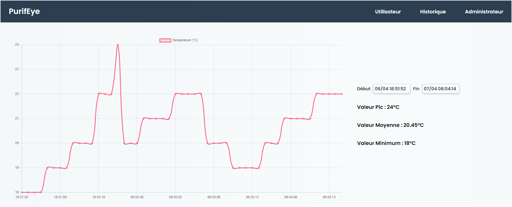

# purifeye
Projet BTS SNIR 2023 - Centrale de Détection de pollution intérieure (interface web)

Récupération des données via différents capteurs.
Ces données sont envoyées par méthode POST via HTTP sur un serveur CRUD (sequelize + express) afin d'être stockées dans une base de donnée.

Ici l'interaction sur la base de donnée se fait côté client en "fetchant" par requête GET sur une route définie par le serveur :

```js
fetch("http://localhost:8080/api/entries/temperature")
```

```js
router.get("/", entries.findAll);
router.get("/temperature", entries.findAllTemp);
app.use('/api/entries', router);
```

Ma partie définie après répartition des tâches consiste à créer une interface graphique permettant de superivser l'historique de l'acquisiton des données.
Projet WIP (07/04/2023)





